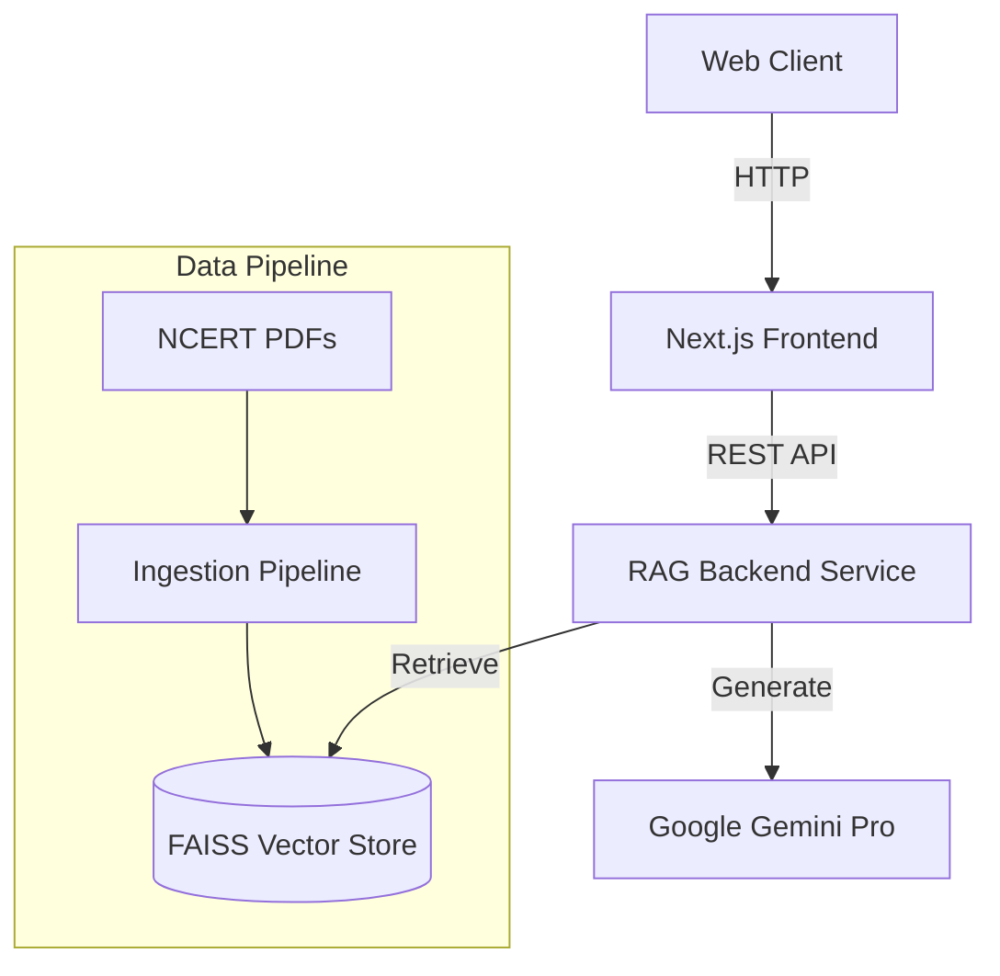

# NCERT Doubt Solver (AI-Powered RAG System)


An enterprise-grade, microservices-based AI system designed to answer student doubts using **Retrieval-Augmented Generation (RAG)** strictly from NCERT textbooks.

---

## 🚀 Project Overview

The **NCERT Doubt Solver** addresses hallucinations common in Large Language Models (LLMs) by grounding all responses in authoritative NCERT textbook content.

### Key Features

* **Zero Hallucination Policy** – Answers are generated strictly from retrieved NCERT context
* **Vector Search** – FAISS + Sentence-Transformers for semantic retrieval
* **Microservices Architecture** – Decoupled ingestion, RAG backend, and frontend
* **Scalable Design** – Dockerized and Kubernetes-ready

---

## 🏗️ Architecture



### Services

1. **Ingestion Engine** – PDF parsing, OCR, chunking, embeddings
2. **RAG Service** – Retrieval + prompt orchestration + LLM inference
3. **Frontend** – Student-facing UI built with Next.js

---

## 🛠️ Tech Stack

| Component      | Technology                                 |
| -------------- | ------------------------------------------ |
| LLM            | Google Gemini 1.5 Pro                      |
| Embeddings     | Sentence-Transformers (`all-MiniLM-L6-v2`) |
| Vector DB      | FAISS                                      |
| Backend        | Python, FastAPI, Uvicorn                   |
| Frontend       | Next.js 14, React, TailwindCSS             |
| Infrastructure | Docker, Docker Compose, Kubernetes         |

---

## ⚡ How to Run Locally

### Prerequisites

* Docker
* Docker Compose
* Google Gemini API Key

### 1. Clone Repository

```bash
git clone https://github.com/your-username/ncert-doubt-solver.git
cd ncert-doubt-solver
```

### 2. Configure Environment

Create a `.env` file in the root directory (**do not commit**):

```env
GOOGLE_API_KEY=your_actual_api_key_here
```

### 3. Start Services

```bash
docker compose up --build
```

### Local Access

* **Frontend**: [http://localhost:3000](http://localhost:3000)
* **Backend API Docs**: [http://localhost:8001/docs](http://localhost:8001/docs)

## 🌐 Live Demo

- **Frontend (Vercel)**: https://ncert-doubt-solver.vercel.app
- **Backend RAG Service (Render)**: https://ncert-rag-service.onrender.com
- **Health Check**: https://ncert-rag-service.onrender.com/health

> ⚠️ Note: The backend is hosted on Render Free Tier (512 MB RAM).
> Cold starts or high memory usage during model loading may cause
> temporary unavailability. The system is production-ready on
> higher-memory infrastructure.


## 🌐 Hosted Deployment (Current)

The project is actively deployed using a split frontend–backend architecture:

### Frontend (Production)

* **Platform**: Vercel
* **URL**: [https://ncert-doubt-solver.vercel.app](https://ncert-doubt-solver.vercel.app)
* **Tech**: Next.js 14 (App Router)

### Backend (Production)

* **Platform**: Render
* **Service**: RAG Backend (FastAPI)
* **Responsibilities**:

  * FAISS vector retrieval
  * Prompt assembly
  * Gemini API inference

> This hosted setup mirrors the local Docker architecture and is intended for demonstration and evaluation purposes.

## ⚠️ Deployment Note (Resource Constraints)

The backend RAG service is deployed on Render (Free Tier – 512 MB RAM).

Due to the memory-intensive nature of:
- Sentence-Transformer models
- FAISS vector indexes
- Cold-start model downloads

the service may occasionally restart or become temporarily unavailable
under concurrent access.

This is a **platform limitation**, not an architectural or implementation issue.
In production, this service is intended to run on:
- Render paid plans
- AWS EC2 / ECS
- GCP / Azure
with ≥ 2 GB RAM.


## 🔒 Security

* No secrets committed to source control
* API keys injected via environment variables
* `.env` strictly git-ignored
* Containers isolated per service

---

## 🚢 Kubernetes Deployment (Optional)

Kubernetes manifests are available in the `k8s/` directory:

```bash
kubectl apply -f k8s/
```

> Note: Kubernetes configs are provided for architectural completeness and were not used in the hosted demo deployment.


## 📄 License

MIT License

