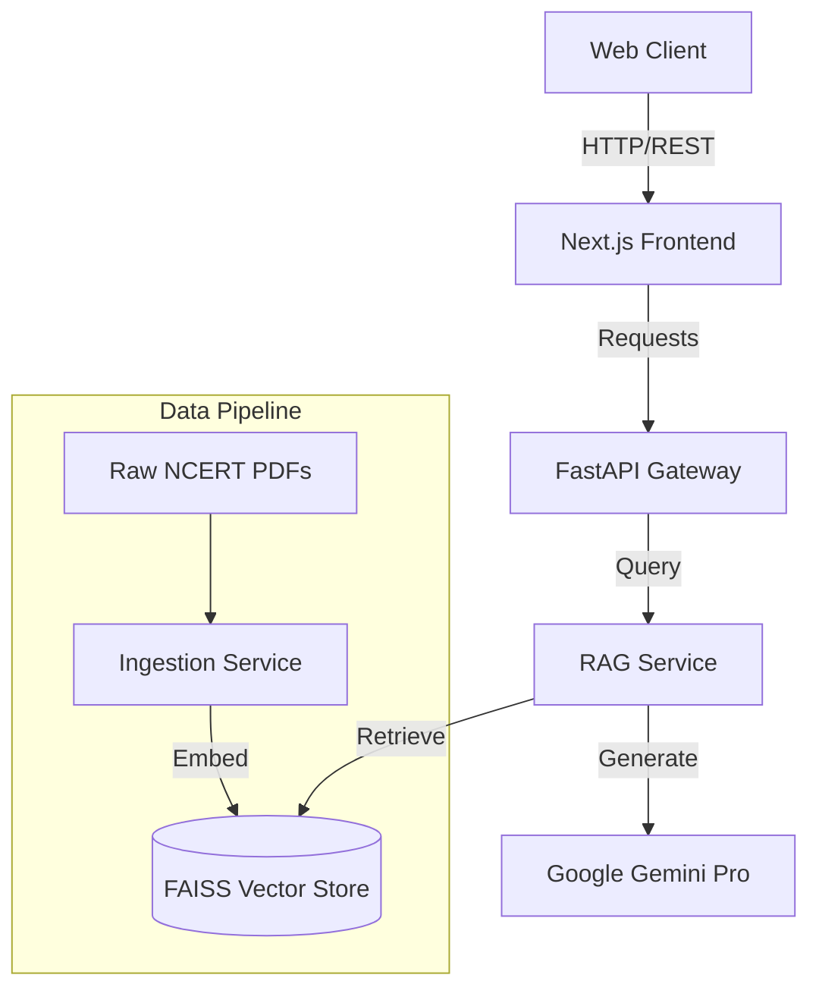

# NCERT Doubt Solver (AI-Powered RAG System)


An enterprise-grade, microservices-based AI system designed to answer student doubts using **Retrieval-Augmented Generation (RAG)** strictly from NCERT textbooks.

## 🚀 Project Overview

The **NCERT Doubt Solver** deals with the hallucinations common in Large Language Models (LLMs) by grounding answers in authoritative operational data—in this case, NCERT textbooks.

### Key Features
*   **Zero Hallucination Policy**: Answers are strictly derived from the provided NCERT PDFs.
*   **Vector Search**: Uses FAISS and `all-MiniLM-L6-v2` for high-precision semantic retrieval.
*   **Microservices Architecture**: Decoupled services for ingestion, retrieval (RAG), API, and Frontend.
*   **Multimodal Capabilities**: Capable of processing both text (current) and diagrams (planned) from textbooks.

---

## 🏗️ Architecture

The system follows a containerized microservices pattern:



### Services
1.  **Ingestion Engine**: Processes PDFs, cleans text, chunks content, and generates embeddings.
2.  **RAG Service**: Handles semantic search and context injection for the LLM.
3.  **API Gateway**: Central entry point for all client requests.
4.  **Frontend**: Modern Next.js UI for student interaction.

---

## 🛠️ Tech Stack

| Component | Technology |
| :--- | :--- |
| **LLM** | Google Gemini 1.5 Pro |
| **Embeddings** | Sentence-Transformers (`all-MiniLM-L6-v2`) |
| **Vector DB** | FAISS (Facebook AI Similarity Search) |
| **Backend** | Python, FastAPI, Uvicorn |
| **Frontend** | Next.js 14, React, TailwindCSS |
| **Infrastructure** | Docker, Docker Compose, Kubernetes |

---

## ⚡ How to Run

### Prerequisites
*   Docker & Docker Compose
*   Google Gemini API Key

### 1. Clone the Repository
```bash
git clone https://github.com/your-username/ncert-doubt-solver.git
cd ncert-doubt-solver
```

### 2. Configure Environment
Create a `.env` file in the root directory. **Do NOT commit this file.**

```bash
GOOGLE_API_KEY=your_actual_api_key_here
```

### 3. Start Application
Launch all microservices using Docker Compose:

```bash
docker compose up --build
```

The application will be available at:
*   **Frontend**: `http://localhost:3000`
*   **API Docs**: `http://localhost:8000/docs`

---

## 🔒 Security

*   **No Hardcoded Secrets**: All sensitive keys (API tokens) are injected via environment variables (`.env`).
*   **Secret Management**: The `.env` file is strictly Git-ignored.
*   **Container Security**: Services run in isolated containers with minimal persistence.

---

## 🚢 Deployment

The project includes Kubernetes manifests for scalable deployment in `k8s/`.

To deploy to a cluster:
```bash
kubectl apply -f k8s/
```

> **Note**: Public hosting is currently disabled to prevent API quota abuse.

---

## ⚠️ Legacy Note

The `ui/` folder contains an older Streamlit prototype. This is retained for internal admin/debugging purposes only and is **not** part of the production Next.js architecture.

---

## 📄 License
MIT License.
